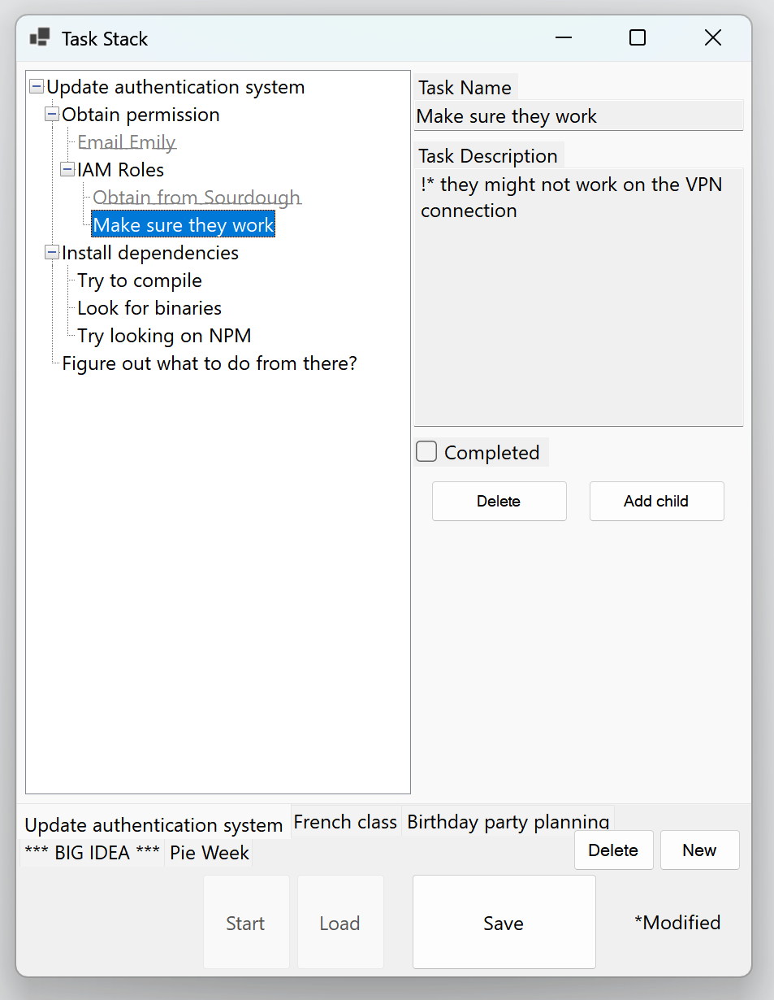
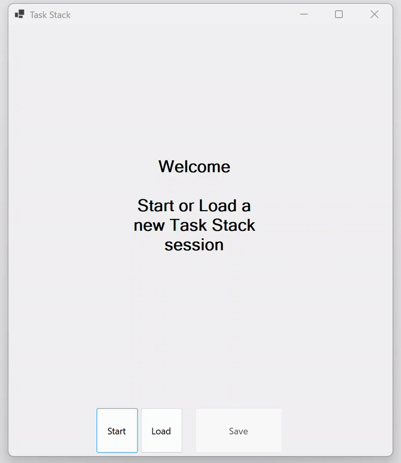

# Task Stack
Organize your to-do list a little differently.

Sometimes you're going down multiple paths at the same time.
Starting one task really means considering three different ones, plus remembering how you finished the last two.

What if there was a better way to keep track of them all?
Rather than visualizing your tasks as a list, imagine them as a tree.

## Features

## Proposal
Task Stack visualizes work the way it looks in my head. Each time I sit at my desk, I have one overall task. For example, running a Python script. But I’ll find that I need to install a module. Then I’ll find that pip doesn’t work for this module. Then I’ll find that I could either compile it myself, or try rewriting the script with a different module. As you can see, each of these tasks serves as one small step inside the previous, sort of like a program’s call stack. The struggle is that I easily lose context and focus too hard on the small details, or a single option among the many that could allow me to go back to the “parent routine”. In addition, when I come back to my desk after a break, I frequently struggle to remember the larger context of what I was doing.

My project is just one widget. The user inputs one root task. Then, the widget allows the user to add new tasks on top of that task, and more on top of that. One task can be highlighted as the “current” task. One task can have multiple child tasks on top, and these tasks can be marked as “alternatives”.

Additional features available include the ability to switch to a new “workspace” with a different root task, and switch between these workspaces. Optionally, workspaces could have a save function, or even a competitive leaderboard with friends if increased complexity is required. More complexity could come from links within tasks that lead the user to operating system windows or online websites.
